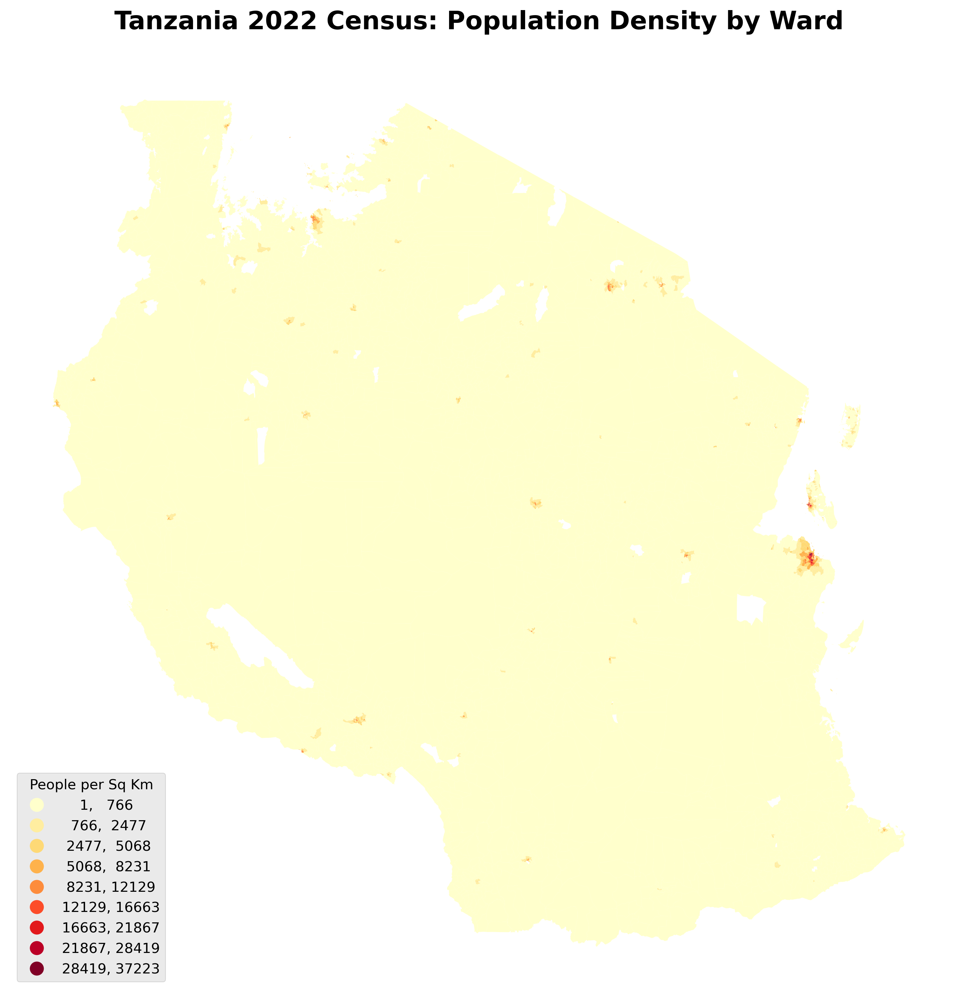
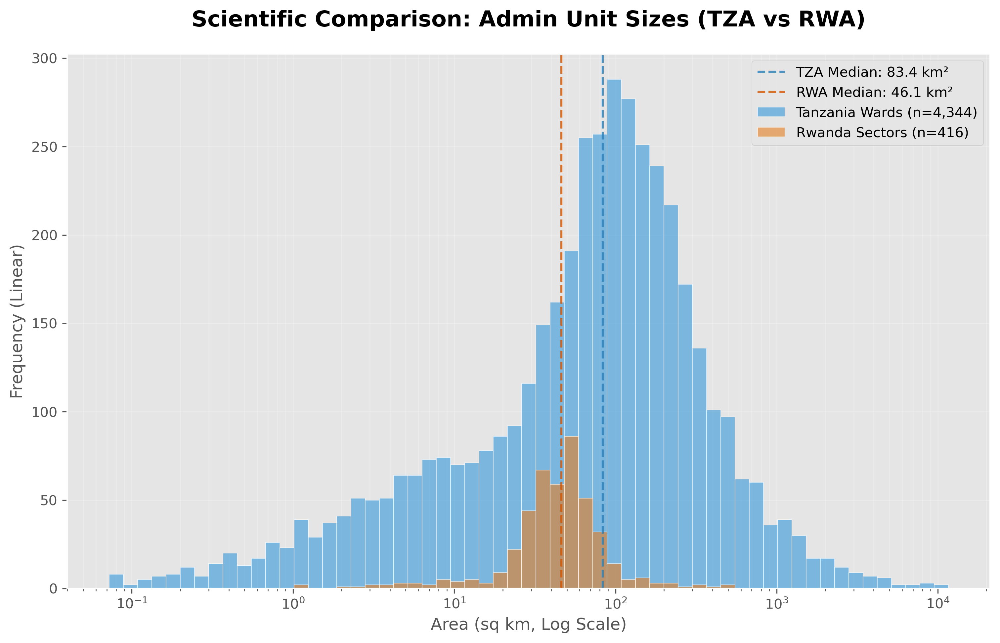
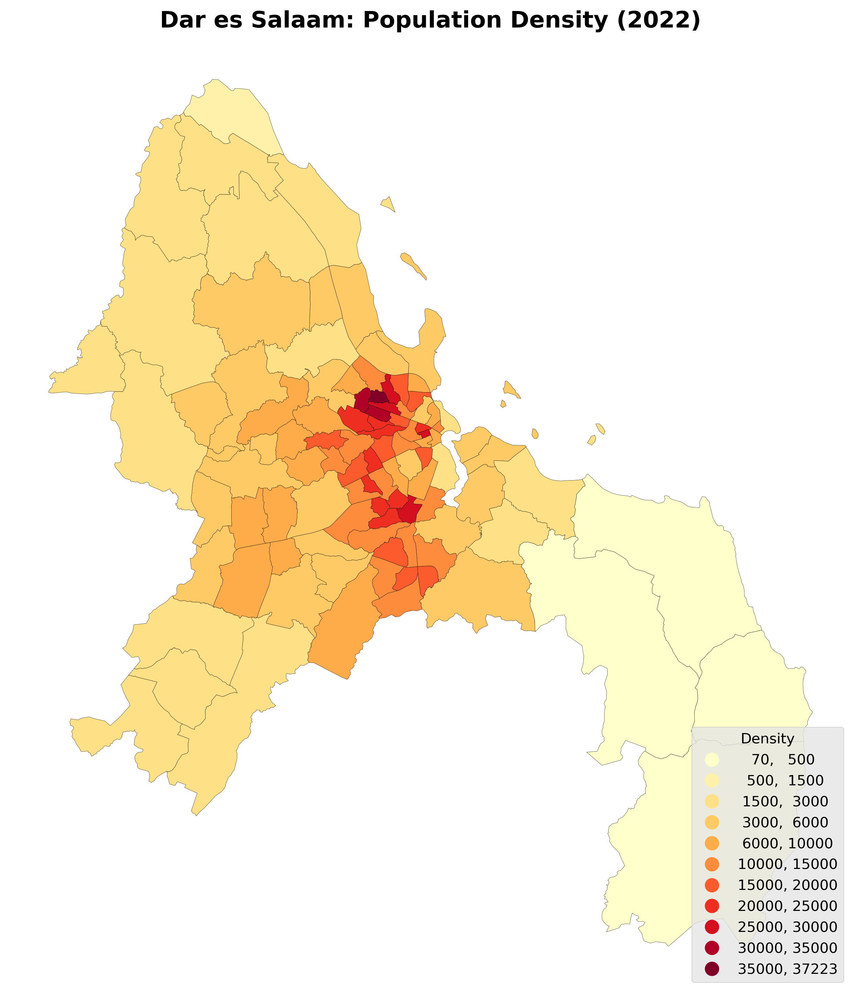
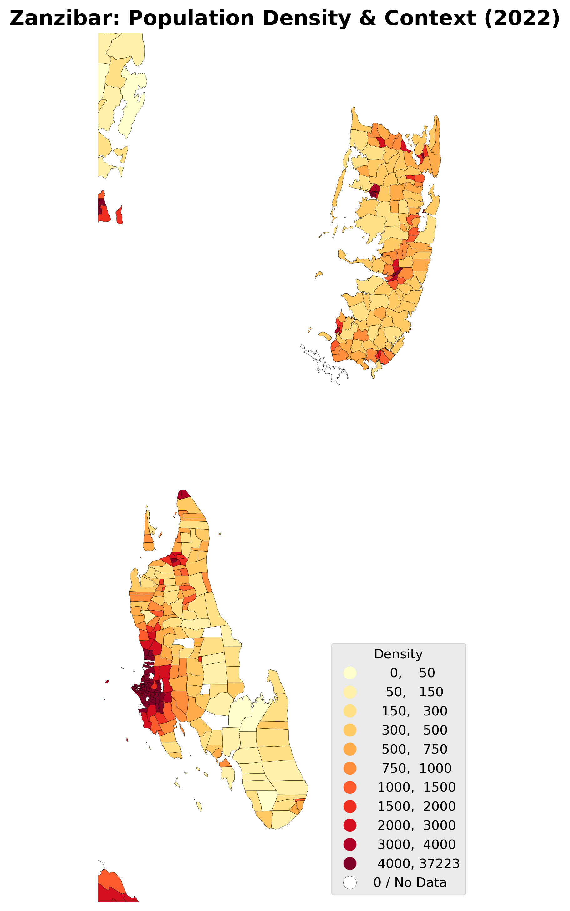

# Tanzania 2022 Population and Housing Census (PHC) Data Compilation

This project provides a comprehensive, granular (Ward-level) population dataset for the United Republic of Tanzania, integrated with the official 2022 administrative boundaries.



## 1. Data Sources

*   **Population Data**: National Bureau of Statistics (NBS) Tanzania.
    *   **Report**: *Administrative Units Population Distribution Report (Volume 1A)*, published January 2024.
    *   **Official Link**: [https://www.nbs.go.tz/uploads/statistics/documents/en-1705484562-Administrative_units_Population_Distribution_Report_Tanzania_volume1a.pdf](https://www.nbs.go.tz/uploads/statistics/documents/en-1705484562-Administrative_units_Population_Distribution_Report_Tanzania_volume1a.pdf)
*   **Geospatial Data**: National Bureau of Statistics (NBS) Tanzania.
    *   **Layer**: 2022 PHC Ward Boundaries.
    *   **Direct Link (Zip)**: [https://www.nbs.go.tz/uploads/statistics/documents/en-1714652282-TANZANIA_2022PHC_WARD_SHAPEFILES.zip](https://www.nbs.go.tz/uploads/statistics/documents/en-1714652282-TANZANIA_2022PHC_WARD_SHAPEFILES.zip)

---

## 2. Detailed Methodology

### Phase 1: Robust Data Retrieval
*   **Solution**: A Python script (`download_census.py`) mimics a browser session to bypass NBS server blocks.
*   **Verification**: PDF data verified against known regional totals.

### Phase 2: PDF Data Extraction
*   **Process**: Programmatic extraction from pages 54--280 using `pdfplumber`. 
*   **Logic**: Context-aware parsing that tracks Region and Council state changes while identifying granular Ward-level population counts.

### Phase 3: Data Cleaning & Normalization
*   **Standardization**: Names normalized to uppercase and stripped of administrative suffixes (e.g., "District Council") to enable reliable joining.
*   **Filtering**: Systematic removal of summary/aggregate rows to prevent data inflation.

### Phase 4: Geospatial Mapping
*   **Strategy**: Multistage join (Full context -> Fallback) with manual overrides for specific naming variances (e.g., `Nghaheleze` → `Ngaheleze`).
*   **Match Rate**: **98.73%** successful mapping across the NBS ward boundary layer.

### Data Quality & Correction (The "Tunduma Outlier")
During initial runs, a density outlier was identified in **Tunduma Ward** (~568,000 people/sq km).
*   **Root Cause**: The PDF report contains summary tables (Table X.0) that list total populations for entire Town/District councils. The parser was incorrectly mapping these large aggregate totals to the specific ward polygon sharing the same name (e.g., Tunduma Council vs. Tunduma Ward).
*   **The Fix**:
    1.  **Strict Keyword Filtering**: The extraction script now explicitly ignores any rows containing `Town`, `City`, `District`, `Council`, or `Total` in the name column.
    2.  **Page Schema Awareness**: Added logic to distinguish between summary pages (Table X.0) and granular ward pages (Table X.1+).
*   **Result**: The corrected maximum density is **~37,222 people/sq km** (Tandale Ward, Dar es Salaam), which aligns with regional urban benchmarks.

---

## 3. Spatial Analysis & Results

Basic spatial analysis was performed using **UTM Zone 37S (EPSG:32737)** for area calculations.

### Key Metrics:
*   **Total Wards Analyzed**: 4,344
*   **Mean Ward Area**: 204.65 sq km
*   **Median Ward Area**: 83.44 sq km
*   **Max Population Density**: ~37,000 people/sq km (Found in Tandale Ward, Dar es Salaam).
*   **Median Population Density**: 138 people/sq km.

### Visual Analysis

#### Ward Size Distribution
The histogram below showing the distribution of ward areas (log-scaled x-axis) highlights the extreme contrast between compact urban wards and expansive rural ones.


#### International Comparison: Tanzania vs. Rwanda
To contextualize the scale of Tanzania's administrative units, we compared Ward sizes with **Rwanda's Sectors (Imirenge)**. 
- While Rwanda is significantly smaller, its administrative units (Sectors) show a much narrower distribution, centered around ~60 km².
- Tanzania's Wards exhibit a vast range, reflecting the geographical diversity from ultra-dense urban centers to massive wilderness areas.



#### Regional Density Zooms
Detailed views of high-density areas:

| Dar es Salaam | Zanzibar |
| :---: | :---: |
|  |  |

---

## 4. Final Data Product & Usage

*   **File**: `data/processed/TZA_2022_Census_Final_Mapped.gpkg` (GeoPackage)
*   **Attributes**: Original NBS boundary fields + `Total_Pop`, `Male_Pop`, `Female_Pop`, `area_sqkm`, `density`.

### How to Reproduce

Ensure you have `pandas`, `geopandas`, `pdfplumber`, `pyogrio`, and `requests` installed.

```powershell
# 1. Download Census PDF
python scripts/download_census.py

# 2. Extract Data to CSV
python scripts/extract_census_data.py

# 3. Join with Shapefile
# (Ensure raw shapefile is extracted to data/raw/)
python scripts/finalize_mapping.py

# 4. Generate Analysis & Plots
python scripts/analysis.py
```

---
**Date**: January 19, 2026
